AzureとPHPでWebサイト作成

## 注意事項
このハンズオンを行うには以下の環境が必要になります。
* インターネットに接続されたコンピュータ
* お好みのテキストエディタ

また、以下のサービスへの登録を済ませておく必要があります。
* Microsoftアカウントの取得
* Microsoft Imagine(旧DreamSpark)の学生認証
* Microsoft Azureのサブスクリプション
* Dropboxアカウント (OneDriveでも可)

準備のできていない方はお近くのスタッフに声をかけてください。
## ファイル構成
ハンズオンのフォルダーには以下のものが含まれています。
* README.md : この資料
* basic/  :Hello PHPのサンプル。記事中で作成します。
* todo/   :自由課題で使用するTodoアプリケーション。

# AzureのWeb Appを使ったPHPサイトの構築
Microsoftのクラウドサービス、Microsoft AzureのWeb Appを使用して、PHPサイトを構築する手順と解説。

## 0.下準備 
まず、上記の注意事項を確認してすべての環境とサービスへの登録が済んでいるかを確認してください。
登録方法がわからない、できない場合はお近くのスタッフまで声をかけてください。

## 1.まずはAzureにアクセスしてみよう
**リソース**…Webサイトや仮想マシンなどAzureで構築できる物の単位

### 管理ポータルへアクセスする 
https://portal.azure.com/ にアクセスします。
Azureの管理は常にこのアドレスからポータルにアクセスし、ブラウザを用いて行います。
Azureサブスクリプションに関連付けられているMicrosoftアカウントでログインすると、このような画面が表示されます。

以前にAzureを**無料試用版サブスクリプション**で使用したことがある場合、サブスクリプションの更新を促す旨の表示が出る場合があります。**Imagineサブスクリプション**を選んで続行してください。

### 管理ポータルの見方
正常にログインが完了すると、**ダッシュボード**が表示されます。ダッシュボードはいわゆる情報板のことで、自分の使用しているリソース等の状態を一度に確認することができます。ダッシュボードに表示される情報はユーザ自身でカスタマイズすることができます。

左方にはメニューが並んでいます。メニューの新規作成ボタンやリソースのブックマークを使用して、新しくリソースを追加したり既存のリソースの管理を行うことができます。

上部の検索バーからリソースの検索を行うことができます。**ベルのアイコン**をクリックすると、Azureからユーザに対する様々な通知を見ることができます。

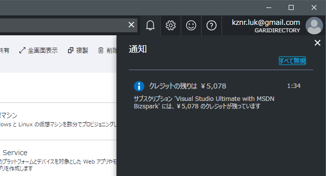

より詳細な解説を下部番外編に記載してありますので、そちらも参考にしましょう。

## 2.Web Appを作成してみよう
**Web App**…Azure上でWebサイトやサービスを構築できるPaaS型のリソース

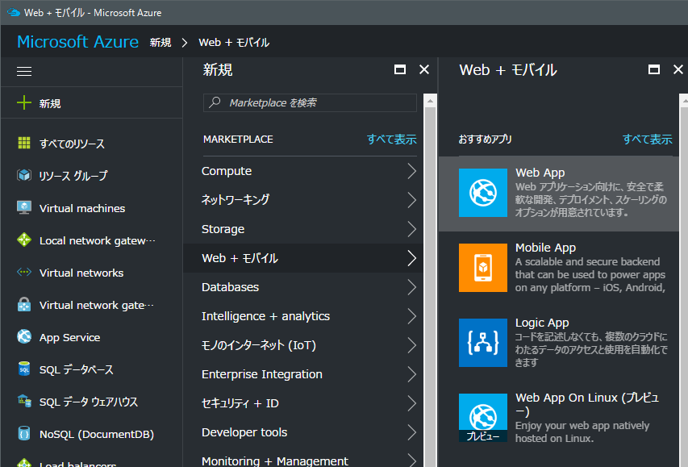

左方の新規ボタンから、**Web + モバイル** →  **Web App**とクリックします。

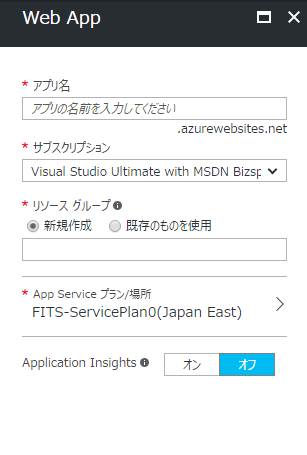

**アプリ名**
これから作るWeb Appの名前を入力します。ここに入力した名前がサブドメインとして使用され、URLの一部(入力した名前.azurewebsites.net)になります。他人と被らない名前を入力する必要があります。

**サブスクリプション**
今回はMicrosoft Imagineを指定します。

**リソースグループ**
この欄では、リソースグループの選択を行います。

リソースグループ…Azureのリソースをまとめて管理するもの。詳細は後述。

新規作成を選択して空白部分に好きな名前を入力します。他人と同じ名前でも使用できますが、自分が現在他のリソースグループで使用している名前は使用することができません。
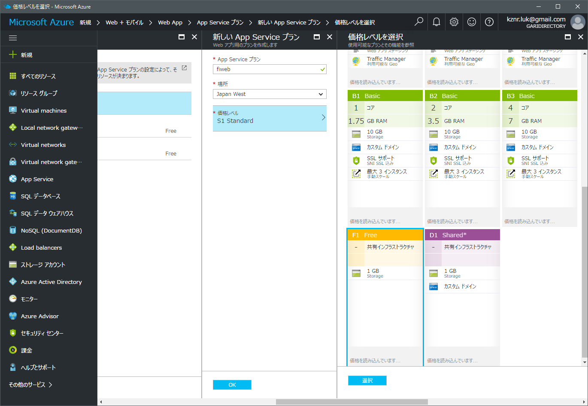

**App Service プラン/場所**
この欄では、Web Appを利用するためのリソースの性能と物理的な場所を選択します。Azureは世界中様々な場所にデータセンタを所有しているので、サービスを提供したい場所に一番近い場所を選択する事ができます。今回は練習ですので、サブスクリプションを消費しないフリープランを、西日本で使用します。

新規作成を選択します。App Serviceプランの欄に好きな名前を入力し、場所はJapan Westを選択します。

価格レベルをクリックし、F1 Freeクリックし選択ボタンを押します。入力が完了したら、OKボタンを押して戻ります。
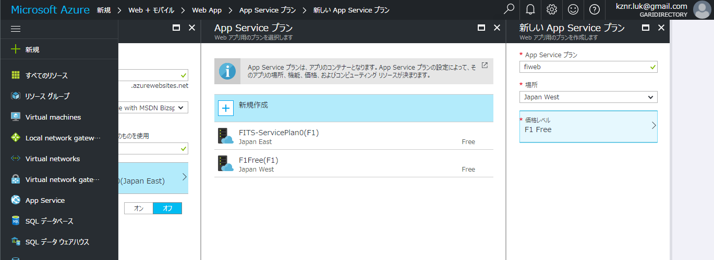

後ほどダッシュボードの操作を学ぶために、**ダッシュボードにピン留めする**のボックスにチェックを入れておきます。
それぞれの入力が間違っていないかを確認して、作成ボタンをクリックするとWeb Appのデプロイが開始されます。

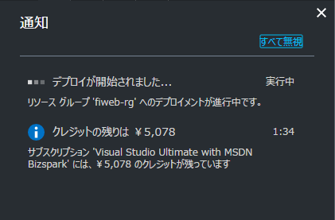

Web Appの場合、デプロイは数十秒で完了します。上部のベルのマークから進捗を確認することができます。"デプロイメントが成功しました"とメッセージが表示されたら、左上のAzureロゴをクリックしてダッシュボードへ戻りましょう。

#### 3.作成したリソースにアクセスしてみよう
リソースへのアクセス方法はいくつかありますが、今回は"すべてのリソース"からアクセスをしてみます。

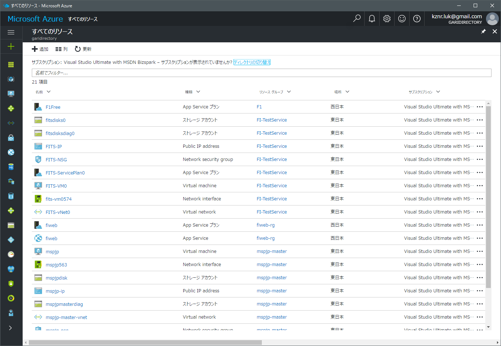

すべてのリソースでは、構築済みのすべてのリソースが一覧となって表示されます。

この中から、先程作成したWeb Appを探してアクセスしてみましょう。リソースの名前をクリックすると、リソースの詳細が表示されます。

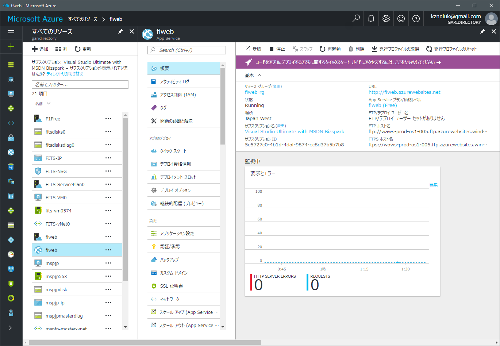

リソースの詳細画面では、そのリソースの様々な管理と監視を行うことができます。

正常に構築できたかを確認するため、URLの欄のリンクをクリックしてみましょう。

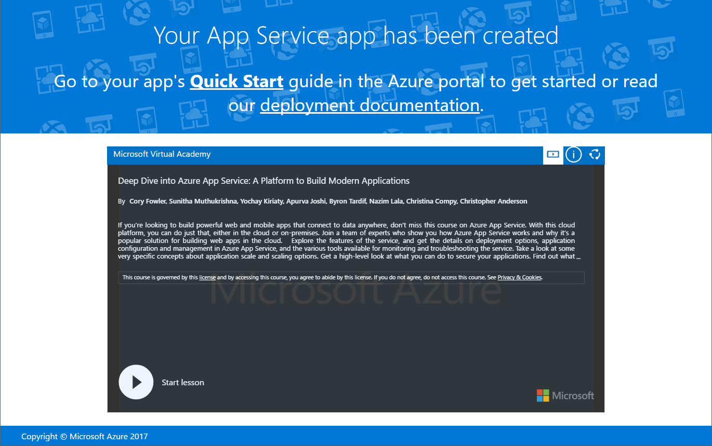

正常に構築が完了していれば、Web Appのデフォルト画面が表示されます。

## 番外:ポータルを使いこなそう
ステップ1での簡易的な解説以外にも、Azureの管理ポータルには便利な使い方がたくさんあります。

### ダッシュボード
Azureの**ダッシュボード**は、様々なリソースの様々な情報を一度に確認することができる、いわばAzureのスタートメニューのような存在です。**ダッシュボード**に表示されている情報のそれぞれを**タイル**と呼び、ユーザ自身でタイルの並べ替え、追加や削除を行う事ができます。他のクラウドサービスにはない機能の1つです。

ダッシュボードはログイン直後の画面に表示されます。また、左上のMicrosoft Azureロゴをクリックすることで表示することもできます。

### タイルの削除
では、ここでタイルの追加と削除を試してみましょう。
先ほどWeb Appを構築した時、**ダッシュボードにピン留めする**にチェックを入れましたので、ダッシュボードにはすでに自分の作ったWeb Appの名前が表示さますす。試しに一度、これを削除してみましょう。

削除したいタイルの上にマウスカーソルを持っていき、右クリックをします。すると**ピン留めを外す**という項目が表示されるので、左クリックで選択してください。

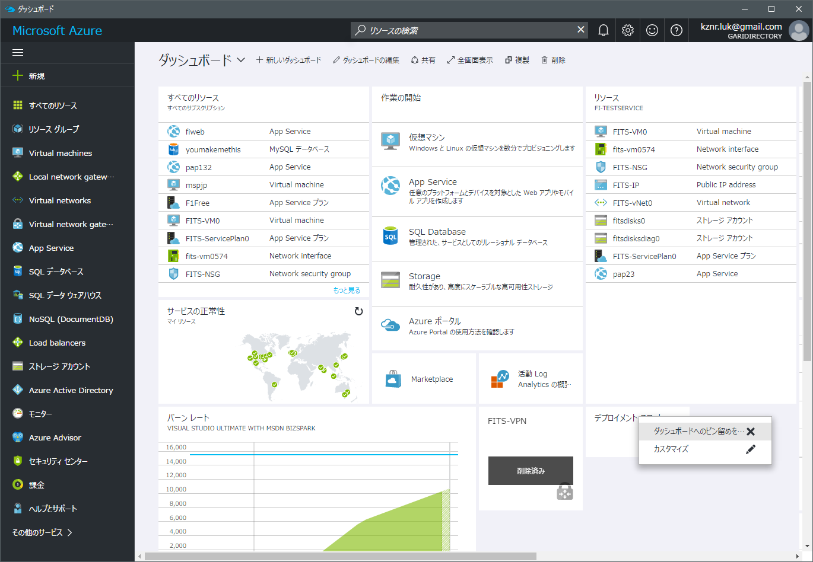

タイルが削除されたら成功です。

### タイルの追加
次に、タイルの追加を試してみましょう。ここでは、先ほどのWeb Appのアクセス数をダッシュボードに追加します。

タイルを追加する方法は、大きく分けて2つあります。ダッシュボードから直接追加する方法と、ダッシュボードに追加したいリソースの詳細画面から追加する方法です。今回は、ダッシュボードがら直接追加する方法を試してみましょう。

ダッシュボードを開き、上部の**鉛筆アイコン**の**編集ボタン**をクリックします。すると、メニューの表示がタイルギャラリーに変わり、タイルを選ぶことができます。

**タイルの検索方法**のリストをリソースグループに変更し、先ほど構築したWeb Appのリソースグループを選択します。リソースの欄に先ほど構築したWeb Appを選択します。

様々なタイルが選択できるようになりました。今回は、作ったWeb Appに対するアクセス数を表示したいので、**要求とエラー**をダッシュボードの好きな場所にドラッグアンドドロップします。

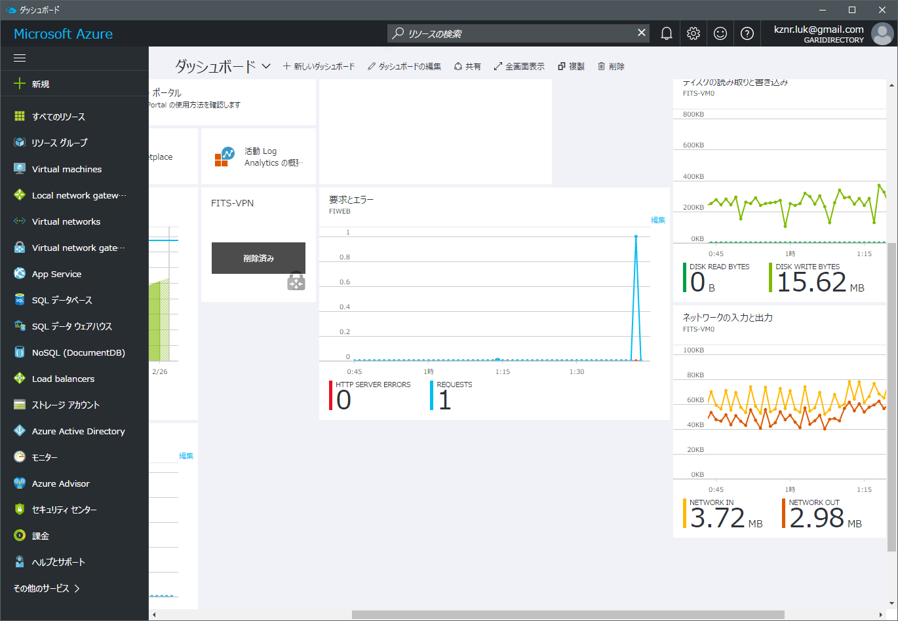

タイルが追加されたら成功です。上部の**カスタマイズ変更**をクリックし、元の画面に戻ります。

### タイルのカスタマイズ
最後に、タイルのカスタマイズを試してみましょう。ここで言うカスタマイズとは、移動とサイズの変更を指します。

まず、右クリックをするかマウスを重ねたときに表示される枠のメニューから、**カスタマイズ**をクリックします。

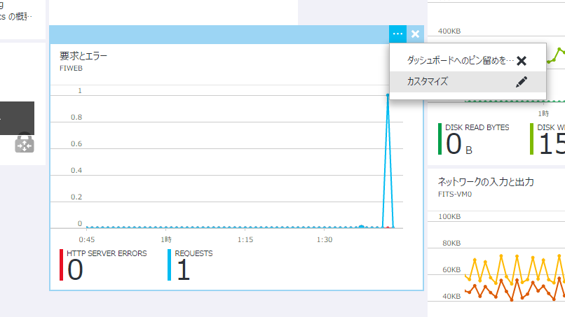

すると、自動的にダッシュボードの編集画面に移動し、タイルの大きさを選ぶことができます。また、その状態でドラッグアンドドロップをすることで、タイルの位置を変更することができます。

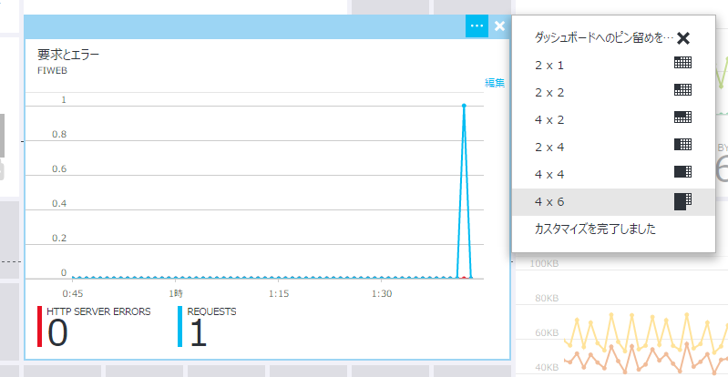

変更が完了したら、**カスタマイズ完了**ボタンをクリックし、元の画面に戻ります。

### リソースグループ
リソースグループは、同じ目的のために使用される様々なリソースをまとめる役割をしています。

規模の大きいサーバをAzure上で構築するとき、それぞれのリソースの数は膨大になり管理がしにくくなります。そこで、リソースグループを使用してまとめることで管理がしやすくなります。

タンスのようなものを思い浮かべてください。タンス自体はAzureで、衣服が1つのリソースだと仮定した場合、リソースグループは引き出しに値します。

[イラスト]

## 4.作成したリソースを操作してみよう

### 基本の画面(概要)
リソースの詳細画面を表示すると、左方にメニューが、右方上部には基本的な操作コマンドが、右方中心部には基本的な情報が表示されます。

[画像]

**停止/起動**ボタンを使用して停止したいときにすぐ停止、起動したいときにすぐ起動する事ができます。

今、自分のWeb Appが起動しているか起動していないかわからないときは、右方下部の状態の部分を見てみるとよいでしょう。起動している時はRunning、停止している時はStoppedと表示されます。

[画像]

### 設定を行う
リソースの設定を行うには、左方のメニューからそれぞれの項目を操作します。基本的にGUIを用いて簡単に設定ができるようになっています。

では、試しにPHPのバージョンを変更してみましょう。左方のメニューから**アプリケーション設定**を選択します。

現在のWeb App内のPHPのデフォルトバージョンは**5.6**が使用されています。これを、最新の**7.0**にアップグレードしてみましょう。

[画像]

すると、アプリケーション設定内の全般設定が表示されます。その中のPHPのバージョンのリストを開いて、**7.0**を選択します。

選択をした状態で保存をクリックすると、自動的にPHPのバージョンが変更されます。

### 監視モニターを活用する
Azureでは、構築や設定のみならず、様々なログやアクセス数、通信料などの監視をすることができます。

概要の画面に戻ってみましょう。左方のメニューを利用します。
右方下部を見てみましょう。監視中の欄に、**要求とエラー**と書かれたグラフが表示されています。このグラフをクリックすると、簡易的なアクセス数の**監視モニター(メトリック)**を表示することができます。

[メトリック]

Web Appの場合はリクエスト数と、サーバでのエラーの数である**HTTP SERVER ERRORS**が表示されます。また、上部の**アラートの追加**をクリックすると、様々な条件を設定し、それを満たした場合に通知をすることができます。

## 番外.Web AppsとPaaS

### PaaSとは
PaaS(Platform as a Service)とは、サービスとしてのプラットフォーム、つまりPHPやNode.jsなどのプラットフォームをサービスとして提供しますよ、と言うものです。

例えば、"Webアプリを作成したい"という目的を持った時。

クラウドのない環境では、OSをインストールし、各種サーバを構築し、ファイアウォールの設定を行い、ネットワークや実行環境などを確保しなければいけまあせんでした。これは、Web開発者にとって大変な労力であって、ハードルの高いものでした。

しかし、Azure等のクラウドではどうでしょうか。ここまで体験して来た皆さんにはわかると思いますが、AzureでPHPの実行環境を整えるのにOSやサーバ、ネットワークの知識は必要ありません。数回のクリックのみで実行環境を整えることができるので、Webアプリの開発に専念することができるのです。

PaaSとは、本当に作りたいアプリ作成のためのプラットフォームを提供するクラウドの形なのです。

[PaaS]

### Web Appsとは
Web Appsとは、AzureのApp Serviceの内、Webサイトをホスティングする機能のことです。簡単に言えば、Azure版のWebサーバと言う事になりますね。

ASP.Net、PHP、Node,js、Python、Javaのサーバサイド環境を簡単に利用することができます。また、WebJobを利用することができます。

URLも、デフォルトで(任意の名前).azurewebsites.netが割り当てられるので、別途ドメインを用意する必要もありません。また、必要であれば独自ドメインの割り当ても可能です。(Imagineサブスクリプションでは不可、別途サブスクリプションを用意する必要あり)

デプロイ(配置)には、FTPやGitの他、OneDriveやDropboxといったクラウドストレージをサポートしています。また、Imagineサブスクリプションでは、1GBのストレージが割り当てられ、その領域を自由に使うことができます。

[WebApps]

## 5.作ったWebアプリをAzureに配置してみよう
番外で解説したように、デプロイ(配置)には複数の方法を利用することができます。FTPやVisualStudioを利用した方法、Git(GitHub,Bitbucket,独自Gitリポジトリ)を利用した方法、クラウドストレージであるOneDriveやDropboxを利用した方法です。

デプロイ自体は、Windowsを利用しなくても行うことができます。お使いのPCがmacOSであっても、外出先のスマートフォンからでも可能です。

今回のガイドでは、クラウドストレージを利用したデプロイを試してみます。

### クラウドストレージからWeb Appsにデプロイしてみよう ###
復習として、WebAppを最初からもう1個作ってみましょう。作り終えたら、リソースの詳細画面のメニューから、デプロイオプションを選択します。

ソースの選択をクリックすると、利用可能なサービスの一覧が出てきます。DropboxかOneDriveを選んでください。

選択が完了したら、承認の欄をクリックします。Azureがあなたのクラウドストレージを利用するために必要な承認を行います。承認するをクリックすると、使っているクラウドサービスに移動され、ログインと許可を求められますので、許可をしてください。許可後、数秒立つとOKが押せるようになります。

パフォーマンステストは未構成のままで問題ありませんので、すべての項目をチェックしたらOKをクリックしましょう。セットアップが開始されます。

OKをクリックした後に、選択したクラウドストレージのフォルダを確認すると、自分のWeb Appsの名前のついたフォルダーが表示されています。今後はこのフォルダを使用してWeb Appsにデプロイすることができます。

### .phpファイルを作成して同期する
ここからは、実際にWeb Appsの内容を自分の作ったものに変更していきます。

まずは、下のコードをコピペしてindex.phpという名前で保存してください。

<?php
  print('Hello PHP!')
 ?>

次に、このファイルを先程Azureと連携させたクラウドストレージのフォルダに配置をします。

Dropbox or Onedrive / アプリ / Azure内に連携させたWeb Appsのフォルダが作成されているので、そこに配置します。

クラウドストレージ自体の同期が完了したことを確認し、Web Appsの詳細画面を開いてデプロイオプションから同期をクリックします。

同期中のアイコンと共に、Synchronizingと表示され同期が始まります。Synchronizedになるまで待ちましょう。

ここで、同期がうまくいかない場合、何度か同期を試してみてください。それでもうまくいかない場合は、一度WebAppsを再起動してみると良いでしょう。

同期が完了したようでしたら、メニューの概要から参照ボタンをクリックすると、クラウドストレージに配置したPHPファイルが正常に配置されている事が確認できます。

> 今回はPHPを使用しましたが、Node.jsやASP.Netなどでも同じようにクラウドストレージを利用してデプロイをすることが可能です。

### 同期に関する解説
Web Appsでは、クラウドストレージからの配置の場合は同期ボタンを押すだけでWeb上に配置をすることができます。また、Gitを利用した配置の場合は同期ボタンを押す必要はなく、Pushをするだけで配置ができます。

WebAppでは配置された拡張子.phpのファイルをPHPプログラムとして認識します。同じように、Node.jsであれば拡張子.js、ASP.Netであれば拡張子.aspxとして配置をすることでWeb Apps上に展開することができます。

index.phpやindex.Phtmlなどの名前のファイルの場合、アクセスするときにファイル名を記述しなくてもアクセスができます。

>index.htmlの場合http://***.azurewebsites.net/ でアクセス可能。どのファイル名がこのように記述しなくてもアクセスが可能になるかどうかは、Web Appsの設定から変更が可能です。(アプリケーション設定＞既定のドキュメント)

# 自由課題:実践！PHP開発をAzureで始めてみよう

WebAppsの作成方法とPHPの配置方法を勉強したので、ここからは自由に好きなアプリを作ってみましょう。
テンプレートを用意しましたので、ここからダウンロードしてみてください。

(URL)

### PHP - Todoアプリ ###
名前と期限日を指定してSubmitボタンをクリックするとタスクが登録される簡易的なTodoアプリです。

/php/todo以下にある3つのファイルを使用して、デプロイしてみましょう。

正常にデプロイが完了すると、ブラウザでTodoアプリが動くことを確認できたと思います。

テンプレートのコードは自由に改変して頂いて構いません。自分だけのオリジナルPHPアプリを作ってみましょう！
なにか困ったことがあれば、お近くのスタッフに声をかけてみてください。自由課題が終わった人は応用編にチャレンジしてみましょう。

## 応用編1: PHPとMySQLを接続して見よう
AzureのWeb App内のPHPなどからデータベースを操作することで、更に高度なWebアプリを作ることができます。

AzureではMySQLとSQL Databaseの2つのデータベースが使用できます。それぞれの利点を理解してみましょう。

**MySQL**
* 一般的なSQLデータベース
* PHPなどから扱いやすい
* Imagineでは(無料なら)最大20MBのDBを複数作成できる

**SQL Database**
* MicrosoftのSQL Serverの仕様に則ったデータベース
* ASP.netなどから扱いやすい
* Imagineでは最大32GBのDBを複数作成できる。
今回はPHPから操作をするので、MySQLを選択します。

### MySQLを作成する ###
Azure上でMySQLを操作するには、Web Appなどと同じように新たにリソースを作成しなければなりません。

Web Appと同じ要領でMySQLを作成してみましょう。

**新規 → Databases → 上部検索ボックス → "MySQL" → MySQL データベース → 作成**

**データベース名**    : 好きな名前
**サブスクリプション**    : Imagine
**データベースの種類**    : 共有
**リソースグループ**    : (任意で変更可)
**場所**    : 西日本(任意で変更可)
**価格レベル**    : 水星
**法律条項**    : 確認して購入

なお、**法律条項**の部分にAzureクレジットを使用することができませんといったメッセージが表示されることがあります。価格レベルが水星になっていれば課金は行われることはありませんが、法律条項の部分で確認を行ってください。

デプロイが完了したら、PHPから作成したデータベースにアクセスするため、必要な情報を確認します。

作成したデータベースの詳細画面から、プロパティを表示します。その中から
* ホスト名
* ユーザ名
* パスワード
をメモ帳などにコピーしておきます。

### MySQL Workbenchのインストール
MySQLクライアントのMySQLWorkbenchを用意します。下記リンクからダウンロードしてインストールしてください。

http://dev.mysql.com/downloads/workbench/

インストールが正常にできない場合、またはわからない事がある時はお近くのスタッフに声をかけてみてください。

### WorkbenchとMySQLの接続
MySQL Workbenchを起動します。

メインウィンドウの上部、Databaseから、Connect to Databaseを選択します。

表示されたウィンドウのHostnameとUsernameの部分にそれぞれMySQLのホスト名とユーザ名を入力します。

次に、Passwordの欄にあるStore in Vaultをクリックし、表示されたウィンドウ内にMySQLのパスワードを入力します。

### todoテーブルを作成する 

### todo-mysql内のapi.phpに接続情報を加える

### **WebAppsにデプロイする

### データベースにデータが入ったことを確認する

## 応用編2: ASP.netをつかってWebサイトを作ってみよう
