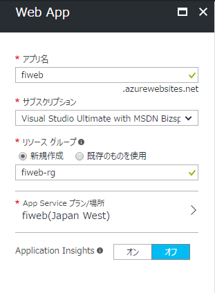
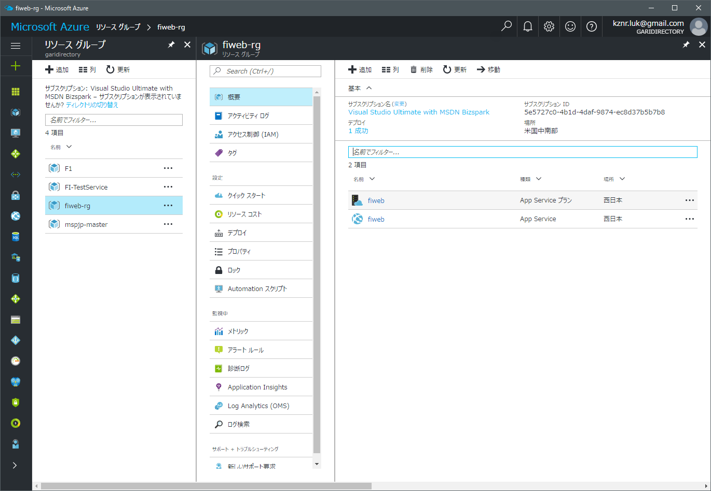
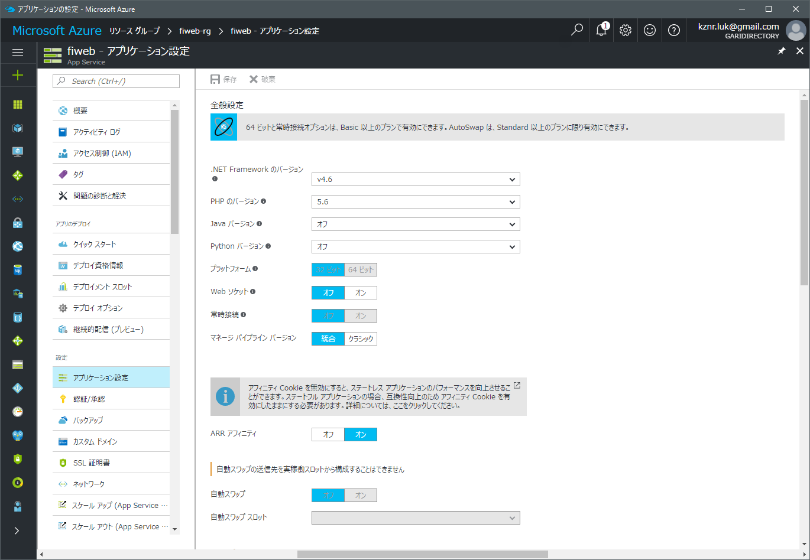
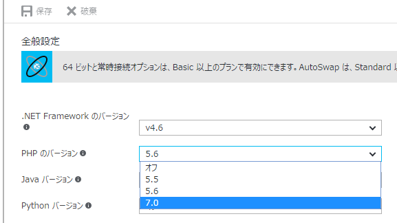
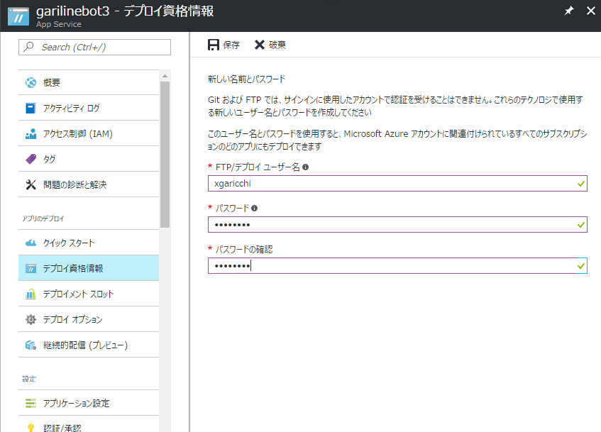
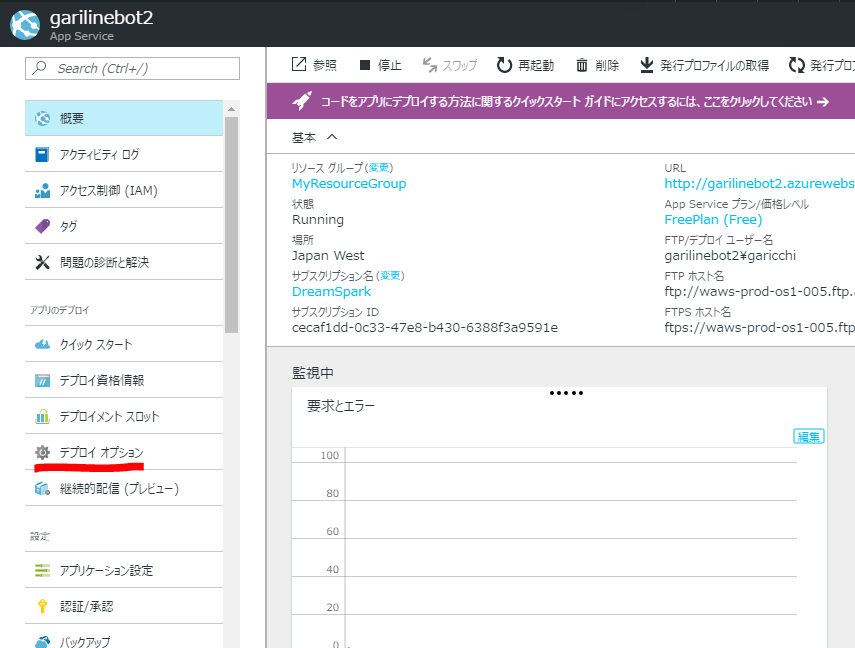
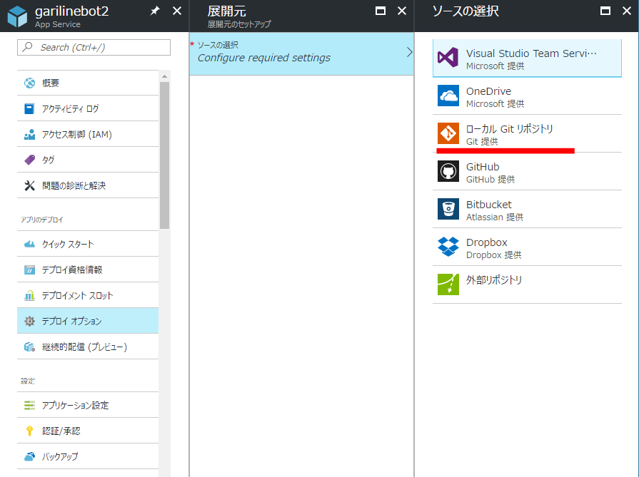
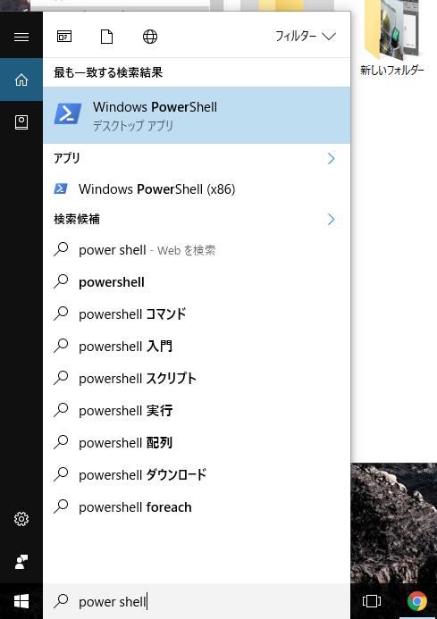
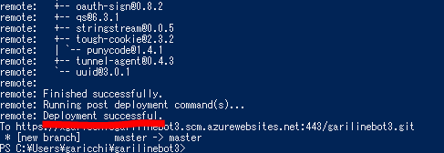

## 注意事項
このハンズオンを行うには以下の環境が必要になります。
* インターネットに接続されたコンピュータ
* お好みのテキストエディタ

また、以下のサービスへの登録を済ませておく必要があります。
* Microsoftアカウントの取得
* Microsoft Imagine(旧DreamSpark)の学生認証
* Microsoft Azureのサブスクリプション
* Dropboxアカウント (OneDriveでも可)

準備のできていない方はお近くのスタッフに声をかけてください。
## ファイル構成
ハンズオンのフォルダーには以下のものが含まれています。
* php/doc/php.md : この資料
* php/code/todo/   :Todoアプリケーション。

# AzureのWeb Appを使ったPHPサイトの構築
Microsoftのクラウドサービス、Microsoft AzureのWeb Appを使用して、PHPサイトを構築する手順と解説。

## 0.下準備 
まず、上記の注意事項を確認してすべての環境とサービスへの登録が済んでいるかを確認してください。
登録方法がわからない、できない場合はお近くのスタッフまで声をかけてください。

## 1.まずはAzureにアクセスしてみよう
**リソース**…Webサイトや仮想マシンなどAzureで構築できる物の単位

### 管理ポータルへアクセスする 
https://portal.azure.com/ にアクセスします。
Azureの管理は常にこのアドレスからポータルにアクセスし、ブラウザを用いて行います。
Azureサブスクリプションに関連付けられているMicrosoftアカウントでログインすると、このような画面が表示されます。


以前にAzureを**無料試用版サブスクリプション**で使用したことがある場合、サブスクリプションの更新を促す旨の表示が出る場合があります。**Imagineサブスクリプション**を選んで続行してください。

### 管理ポータルの見方
正常にログインが完了すると、**ダッシュボード**が表示されます。ダッシュボードはいわゆる情報板のことで、自分の使用しているリソース等の状態を一度に確認することができます。ダッシュボードに表示される情報はユーザ自身でカスタマイズすることができます。

左方にはメニューが並んでいます。メニューの新規作成ボタンやリソースのブックマークを使用して、新しくリソースを追加したり既存のリソースの管理を行うことができます。


上部の検索バーからリソースの検索を行うことができます。**ベルのアイコン**をクリックすると、Azureからユーザに対する様々な通知を見ることができます。


より詳細な解説を下部番外編に記載してありますので、そちらも参考にしましょう。

## 2.Web Appを作成してみよう
**Web App**…Azure上でWebサイトやサービスを構築できるPaaS型のリソース


左方の新規ボタンから、**Web + モバイル** →  **Web App**とクリックします。


**アプリ名**
これから作るWeb Appの名前を入力します。ここに入力した名前がサブドメインとして使用され、URLの一部(入力した名前.azurewebsites.net)になります。他人と被らない名前を入力する必要があります。

**サブスクリプション**
今回はMicrosoft Imagineを指定します。

**リソースグループ**
この欄では、リソースグループの選択を行います。

リソースグループ…Azureのリソースをまとめて管理するもの。詳細は後述。

新規作成を選択して空白部分に好きな名前を入力します。他人と同じ名前でも使用できますが、自分が現在他のリソースグループで使用している名前は使用することができません。


**App Service プラン/場所**
この欄では、Web Appを利用するためのリソースの性能と物理的な場所を選択します。Azureは世界中様々な場所にデータセンタを所有しているので、サービスを提供したい場所に一番近い場所を選択する事ができます。今回は練習ですので、サブスクリプションを消費しないフリープランを、西日本で使用します。

新規作成を選択します。App Serviceプランの欄に好きな名前を入力し、場所はJapan Westを選択します。

価格レベルをクリックし、F1 Freeクリックし選択ボタンを押します。入力が完了したら、OKボタンを押して戻ります。




後ほどダッシュボードの操作を学ぶために、**ダッシュボードにピン留めする**のボックスにチェックを入れておきます。
それぞれの入力が間違っていないかを確認して、作成ボタンをクリックするとWeb Appのデプロイが開始されます。


Web Appの場合、デプロイは数十秒で完了します。上部のベルのマークから進捗を確認することができます。"デプロイメントが成功しました"とメッセージが表示されたら、左上のAzureロゴをクリックしてダッシュボードへ戻りましょう。


#### 3.作成したリソースにアクセスしてみよう
リソースへのアクセス方法はいくつかありますが、今回は"すべてのリソース"からアクセスをしてみます。


すべてのリソースでは、構築済みのすべてのリソースが一覧となって表示されます。

この中から、先程作成したWeb Appを探してアクセスしてみましょう。リソースの名前をクリックすると、リソースの詳細が表示されます。


リソースの詳細画面では、そのリソースの様々な管理と監視を行うことができます。

正常に構築できたかを確認するため、URLの欄のリンクをクリックしてみましょう。


正常に構築が完了していれば、Web Appのデフォルト画面が表示されます。


## 4.作成したリソースを操作してみよう

### 基本の画面(概要)
リソースの詳細画面を表示すると、左方にメニューが、右方上部には基本的な操作コマンドが、右方中心部には基本的な情報が表示されます。



**停止/起動**ボタンを使用して停止したいときにすぐ停止、起動したいときにすぐ起動する事ができます。


今、自分のWeb Appが起動しているか起動していないかわからないときは、右方下部の状態の部分を見てみるとよいでしょう。起動している時はRunning、停止している時はStoppedと表示されます。


### 設定を行う
リソースの設定を行うには、左方のメニューからそれぞれの項目を操作します。基本的にGUIを用いて簡単に設定ができるようになっています。

では、試しにPHPのバージョンを変更してみましょう。左方のメニューから**アプリケーション設定**を選択します。

現在のWeb App内のPHPのデフォルトバージョンは**5.6**が使用されています。これを、最新の**7.0**にアップグレードしてみましょう。



すると、アプリケーション設定内の全般設定が表示されます。その中のPHPのバージョンのリストを開いて、**7.0**を選択します。

選択をした状態で保存をクリックすると、自動的にPHPのバージョンが変更されます。

### 監視モニターを活用する
Azureでは、構築や設定のみならず、様々なログやアクセス数、通信料などの監視をすることができます。

概要の画面に戻ってみましょう。左方のメニューを利用します。
右方下部を見てみましょう。監視中の欄に、**要求とエラー**と書かれたグラフが表示されています。このグラフをクリックすると、簡易的なアクセス数の**監視モニター(メトリック)**を表示することができます。



Web Appの場合はリクエスト数と、サーバでのエラーの数である**HTTP SERVER ERRORS**が表示されます。また、上部の**アラートの追加**をクリックすると、様々な条件を設定し、それを満たした場合に通知をすることができます。

## 番外.Web AppsとPaaS

### PaaSとは
PaaS(Platform as a Service)とは、サービスとしてのプラットフォーム、つまりPHPやNode.jsなどのプラットフォームをサービスとして提供しますよ、と言うものです。

例えば、"Webアプリを作成したい"という目的を持った時。

クラウドのない環境では、OSをインストールし、各種サーバを構築し、ファイアウォールの設定を行い、ネットワークや実行環境などを確保しなければいけまあせんでした。これは、Web開発者にとって大変な労力であって、ハードルの高いものでした。

しかし、Azure等のクラウドではどうでしょうか。ここまで体験して来た皆さんにはわかると思いますが、AzureでPHPの実行環境を整えるのにOSやサーバ、ネットワークの知識は必要ありません。数回のクリックのみで実行環境を整えることができるので、Webアプリの開発に専念することができるのです。

PaaSとは、本当に作りたいアプリ作成のためのプラットフォームを提供するクラウドの形なのです。


### Web Appsとは
Web Appsとは、AzureのApp Serviceの内、Webサイトをホスティングする機能のことです。簡単に言えば、Azure版のWebサーバと言う事になりますね。

ASP.Net、PHP、Node,js、Python、Javaのサーバサイド環境を簡単に利用することができます。また、WebJobを利用することができます。

URLも、デフォルトで(任意の名前).azurewebsites.netが割り当てられるので、別途ドメインを用意する必要もありません。また、必要であれば独自ドメインの割り当ても可能です。(Imagineサブスクリプションでは不可、別途サブスクリプションを用意する必要あり)

デプロイ(配置)には、FTPやGitの他、OneDriveやDropboxといったクラウドストレージをサポートしています。また、Imagineサブスクリプションでは、1GBのストレージが割り当てられ、その領域を自由に使うことができます。

## 5.作ったWebアプリをAzureに配置してみよう
番外で解説したように、デプロイ(配置)には複数の方法を利用することができます。FTPやVisualStudioを利用した方法、Git(GitHub,Bitbucket,独自Gitリポジトリ)を利用した方法、クラウドストレージであるOneDriveやDropboxを利用した方法です。

デプロイ自体は、Windowsを利用しなくても行うことができます。お使いのPCがmacOSであっても、外出先のスマートフォンからでも可能です。

今回のガイドでは、Gitを利用したデプロイを試してみます。

**デプロイ資格情報**を押し、好きな名前とパスワードを設定し、**保存**を押します。



続いて**デプロイオプション**を押します。



**ソースの選択**から**ローカルGitリポジトリ**を押します。



**OK**を押します。

再び**概要**に戻り、**GitクローンURL**に書いてあるURLをコピーします。


シェルを立ち上げます。Macの方は**ターミナル**アプリを、Windowsの方は**PowerShell**を立ち上げます。



好きなディレクトリで先ほどコピーしたWebAppsのGitクローンURLをクローンします。

Windowsの方は右クリックでクリップボードの内容を貼り付けることができます。

```sh
git clone {WebAppsに表示されているGitクローンURL}
```

途中で認証情報を聞かれるので**デプロイ資格情報**で設定したユーザー名とパスワードを入れます。


Windowsのエクスプローラーでフォルダを見ると、cloneした場所に新しくWebAppsと同じ名前のフォルダができています。


このcloneしたフォルダの中に、以下のコードを記載したindex.phpというフォルダを作りましょう。

```php
<?php
  echo "Hello PHP!";
?>
```

シェルに戻り、cdコマンドでcloneしたフォルダに移動します。

```
cd {cloneしたフォルダ}
```

今回作成したWebAppsでは、Git PushをするとWebApps上にプログラムを配置することができます。

以下のコマンドを実行してください。

{commit message}のところは好きなメッセージにしてください。

```sh
git add .
git commit -m "{commit message}"
git push
```

Deployment successfulと表示されればOKです。



WebAppsのURLにアクセスすると、Hello PHPと表示されれば成功です。


### PHP - Todoアプリ ###
名前と期限日を指定してSubmitボタンをクリックするとタスクが登録される簡易的なTodoアプリです。

/php/code/todo以下にある3つのファイルを使用して、デプロイしてみましょう。

正常にデプロイが完了すると、ブラウザでTodoアプリが動くことを確認できたと思います。

テンプレートのコードは自由に改変して頂いて構いません。自分だけのオリジナルPHPアプリを作ってみましょう！
なにか困ったことがあれば、お近くのスタッフに声をかけてみてください。自由課題が終わった人は応用編にチャレンジしてみましょう。

## 応用編1: PHPとMySQLを接続してTodoアプリを作ろう
AzureのWeb App内のPHPなどからデータベースを操作することで、更に高度なWebアプリを作ることができます。

AzureではMySQLとSQL Databaseの2つのデータベースが使用できます。それぞれの利点を理解してみましょう。

**MySQL**
* 一般的なSQLデータベース
* PHPなどから扱いやすい
* Imagineでは(無料なら)最大20MBのDBを複数作成できる

**SQL Database**
* MicrosoftのSQL Serverの仕様に則ったデータベース
* ASP.netなどから扱いやすい
* Imagineでは最大32GBのDBを複数作成できる。
今回はPHPから操作をするので、MySQLを選択します。

### MySQLを作成する ###
Azure上でMySQLを操作するには、Web Appなどと同じように新たにリソースを作成しなければなりません。

Web Appと同じ要領でMySQLを作成してみましょう。

**新規 → Databases → 上部検索ボックス → "MySQL" → MySQL データベース → 作成**

**データベース名**    : 好きな名前
**サブスクリプション**    : Imagine
**データベースの種類**    : 共有
**リソースグループ**    : (任意で変更可)
**場所**    : 西日本(任意で変更可)
**価格レベル**    : 水星
**法律条項**    : 確認して購入

なお、**法律条項**の部分にAzureクレジットを使用することができませんといったメッセージが表示されることがあります。価格レベルが水星になっていれば課金は行われることはありませんが、法律条項の部分で確認を行ってください。

デプロイが完了したら、PHPから作成したデータベースにアクセスするため、必要な情報を確認します。

作成したデータベースの詳細画面から、プロパティを表示します。その中から
* ホスト名
* ユーザ名
* パスワード
をメモ帳などにコピーしておきます。

### 環境の準備
Todoアプリのテンプレートを下記に用意しましたので、ダウンロードしてください。


### MySQL Workbenchのインストール
MySQLクライアントのMySQLWorkbenchを用意します。下記リンクからダウンロードしてインストールしてください。

http://dev.mysql.com/downloads/workbench/

インストールが正常にできない場合、またはわからない事がある時はお近くのスタッフに声をかけてみてください。

### WorkbenchとMySQLの接続
MySQL Workbenchを起動します。

メインウィンドウの上部、Databaseから、Connect to Databaseを選択します。

表示されたウィンドウのHostnameとUsernameの部分にそれぞれMySQLのホスト名とユーザ名を入力します。

次に、Passwordの欄にあるStore in Vaultをクリックし、表示されたウィンドウ内にMySQLのパスワードを入力します。

### todoテーブルを作成する 
Query 1のタブに下記を入力します。

```sql
use データベース名;

create table todo (
    id int auto_increment primary key,
    name text,
    date text
 ):
```

### todo-mysql内のapi.phpに接続情報を加える
todo-mysql内のapi.phpを開き、編集をします。
8~10行目の下記の部分の対応する値を自分のデータベースのものに置き換えましょう。
```php:api.php
$mysql_host = 'ja-cdbr-azure-west-a.cloudapp.net';
$mysql_user = 'b82cee9bd25c06';
$mysql_pass = 'ee67f77a';
```

### WebAppsにデプロイする
上記と同じように、クラウドストレージ経由でWebAppにデプロイします。

タスクをきちんと登録できることを確認します。


### データベースにデータが入ったことを確認する
MySQL WorkBenchでデータベースにデータが入力されたかを確認します。


## 応用編2:ASP.NetによるWebサイトデプロイ
VisualStudioユーザの方は、ぜひこの方法によるWebサイトデプロイにも挑戦してみましょう。

### VisualStudioをインストールする
https://www.visualstudio.com/ から、最新版のVisualStudioをダウンロードしてインストールします。

2015以降のVisualStudioを使用している方は、そちらを使用しても構いません。
VisualStudioはとてもファイルサイズが大きいので、ハンズオン会場でのインストールはおすすめしません。

### 準備
上記と同じ手順でAzure WebAppsを2つ新規作成します。
VisualStudioを立ち上げ、ASP.Netのプロジェクトを新規作成します。

## 番外:ポータルを使いこなそう
ステップ1での簡易的な解説以外にも、Azureの管理ポータルには便利な使い方がたくさんあります。

### ダッシュボード
Azureの**ダッシュボード**は、様々なリソースの様々な情報を一度に確認することができる、いわばAzureのスタートメニューのような存在です。**ダッシュボード**に表示されている情報のそれぞれを**タイル**と呼び、ユーザ自身でタイルの並べ替え、追加や削除を行う事ができます。他のクラウドサービスにはない機能の1つです。


ダッシュボードはログイン直後の画面に表示されます。また、左上のMicrosoft Azureロゴをクリックすることで表示することもできます。

### タイルの削除
では、ここでタイルの追加と削除を試してみましょう。
先ほどWeb Appを構築した時、**ダッシュボードにピン留めする**にチェックを入れましたので、ダッシュボードにはすでに自分の作ったWeb Appの名前が表示さますす。試しに一度、これを削除してみましょう。

削除したいタイルの上にマウスカーソルを持っていき、右クリックをします。すると**ピン留めを外す**という項目が表示されるので、左クリックで選択してください。


タイルが削除されたら成功です。

### タイルの追加
次に、タイルの追加を試してみましょう。ここでは、先ほどのWeb Appのアクセス数をダッシュボードに追加します。

タイルを追加する方法は、大きく分けて2つあります。ダッシュボードから直接追加する方法と、ダッシュボードに追加したいリソースの詳細画面から追加する方法です。今回は、ダッシュボードがら直接追加する方法を試してみましょう。

ダッシュボードを開き、上部の**鉛筆アイコン**の**編集ボタン**をクリックします。すると、メニューの表示がタイルギャラリーに変わり、タイルを選ぶことができます。


**タイルの検索方法**のリストをリソースグループに変更し、先ほど構築したWeb Appのリソースグループを選択します。リソースの欄に先ほど構築したWeb Appを選択します。

様々なタイルが選択できるようになりました。今回は、作ったWeb Appに対するアクセス数を表示したいので、**要求とエラー**をダッシュボードの好きな場所にドラッグアンドドロップします。


タイルが追加されたら成功です。上部の**カスタマイズ変更**をクリックし、元の画面に戻ります。

### タイルのカスタマイズ
最後に、タイルのカスタマイズを試してみましょう。ここで言うカスタマイズとは、移動とサイズの変更を指します。

まず、右クリックをするかマウスを重ねたときに表示される枠のメニューから、**カスタマイズ**をクリックします。


すると、自動的にダッシュボードの編集画面に移動し、タイルの大きさを選ぶことができます。また、その状態でドラッグアンドドロップをすることで、タイルの位置を変更することができます。


変更が完了したら、**カスタマイズ完了**ボタンをクリックし、元の画面に戻ります。

### リソースグループ
リソースグループは、同じ目的のために使用される様々なリソースをまとめる役割をしています。

規模の大きいサーバをAzure上で構築するとき、それぞれのリソースの数は膨大になり管理がしにくくなります。そこで、リソースグループを使用してまとめることで管理がしやすくなります。

タンスのようなものを思い浮かべてください。タンス自体はAzureで、衣服が1つのリソースだと仮定した場合、リソースグループは引き出しに値します。


